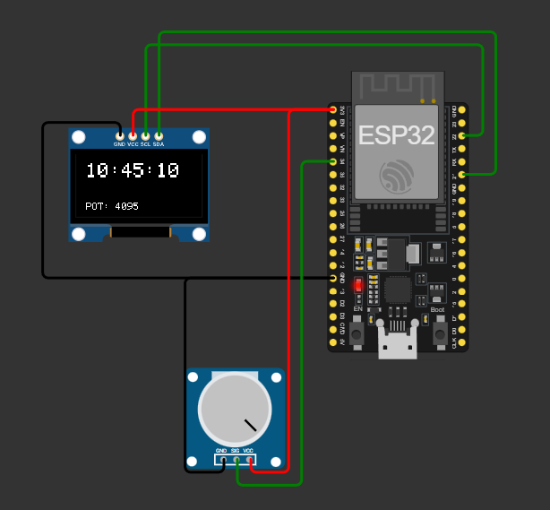

# PUNTO 2 I2C: Visualización de reloj digital y lectura de potenciómetro en pantalla OLED SSD1306 

## Objetivo
[cite_start]Comprender el funcionamiento de la interfaz de comunicación serial síncrona **I2C** y el manejo de convertidores análogo-digitales (ADC) para la visualización de datos en tiempo real en periféricos direccionables[cite: 7, 22, 64].

---

## Descripción general 
[cite_start]En este proyecto se implementa un **reloj digital** por software que muestra la hora junto con el valor bruto leído desde un **potenciómetro analógico**[cite: 65]. [cite_start]Ambos datos se visualizan simultáneamente en una **pantalla OLED I2C SSD1306** y se respaldan mediante el **Monitor Serial**[cite: 7, 142].

---

## Componentes requeridos 

| Componente | Cantidad | Descripción | 
|-------------|-----------|-------------| 
| **ESP32 DevKit** | 1 | Microcontrolador principal |
| **Pantalla OLED SSD1306** | 1 | Comunicación por I2C (dirección estándar 0x3C) |
| **Potenciómetro** | 1 | Control analógico de entrada (ADC1) |
| **Cable USB** | 1 | Programación y monitor serial |
| **PC con Arduino IDE** | 1 | Entorno de programación y monitoreo |

---

## Esquema de conexión 

### Pantalla OLED SSD1306 (Bus I2C)
| OLED Pin | ESP32 Pin sugerido | Función |
|-----------|-------------------|---------|
| VCC | 3.3V | Alimentación |
| GND | GND | Tierra |
| SDA | **GPIO 21** | [cite_start]Datos seriales I2C [cite: 70, 78] |
| SCL | **GPIO 22** | [cite_start]Reloj serial I2C [cite: 70, 79] | 

### Potenciómetro (Entrada Análoga)
| Pin Potenciómetro | ESP32 | Función |
|-------------------|--------|---------|
| Terminal izquierda | 3.3V | Referencia positiva |
| Terminal derecha | GND | Referencia negativa |
| Terminal central | **GPIO 34** | [cite_start]Señal análoga (ADC1) [cite: 81, 105] | 



---

## Lógica del programa 

1. [cite_start]**Inicialización:** Configura la comunicación I2C para la OLED y el puerto serial a **115200 baudios**[cite: 47, 130].
2. [cite_start]**Adquisición de datos:** Lee continuamente el valor del potenciómetro en el pin 34 con una resolución de 12 bits (0 a 4095)[cite: 132, 247, 248].
3. [cite_start]**Gestión del tiempo:** Utiliza la función `millis()` para crear un reloj no bloqueante que incrementa segundos, minutos y horas cada 1000ms[cite: 66, 144].
4. [cite_start]**Visualización:** Actualiza el buffer de la pantalla OLED con la hora formateada y el valor del ADC, enviando los datos mediante la función `display.display()`[cite: 139, 150].
5. [cite_start]**Depuración:** Envía los mismos datos al Monitor Serial cada segundo para verificar el funcionamiento y facilitar el monitoreo[cite: 2, 137].

---

## Ajustes y recomendaciones 

- [cite_start]**Librerías:** Es obligatorio instalar las librerías `Adafruit SSD1306` y `Adafruit GFX` desde el gestor de librerías del IDE para el manejo correcto de la pantalla[cite: 147, 148].
- **Dirección I2C:** La dirección estándar de este módulo suele ser `0x3C`. [cite_start]Si la pantalla no inicializa, verifique si su módulo utiliza `0x3D`[cite: 146, 397].
- [cite_start]**Pines Seguros:** Se utiliza el pin **34** por ser un pin del ADC1, los cuales son seguros de usar y son estrictamente de solo entrada[cite: 80, 81, 109].

---

## Resultados esperados 

**Salida en el Monitor Serial:** ``` 
Hora actual: 10:45:01 | Potenciometro: 1324 
Hora actual: 10:45:02 | Potenciometro: 1308

¡Hecho, Jerónimo! Aquí tienes la estructura definitiva del README para el Punto 2, ajustada a tu autoría y sin el bloque de código, tal como lo solicitaste.

Está lista para que la copies y pegues directamente en tu archivo .md.

Markdown
# PUNTO 2 I2C: Visualización de reloj digital y lectura de potenciómetro en pantalla OLED SSD1306 

## Objetivo
[cite_start]Comprender el funcionamiento de la interfaz de comunicación serial síncrona **I2C** y el manejo de convertidores análogo-digitales (ADC) para la visualización de datos en tiempo real en periféricos direccionables[cite: 7, 22, 64].

---

## Descripción general 
[cite_start]En este proyecto se implementa un **reloj digital** por software que muestra la hora junto con el valor bruto leído desde un **potenciómetro analógico**[cite: 65]. [cite_start]Ambos datos se visualizan simultáneamente en una **pantalla OLED I2C SSD1306** y se respaldan mediante el **Monitor Serial**[cite: 7, 142].

---

## Componentes requeridos 

| Componente | Cantidad | Descripción | 
|-------------|-----------|-------------| 
| **ESP32 DevKit** | 1 | Microcontrolador principal |
| **Pantalla OLED SSD1306** | 1 | Comunicación por I2C (dirección estándar 0x3C) |
| **Potenciómetro** | 1 | Control analógico de entrada (ADC1) |
| **Cable USB** | 1 | Programación y monitor serial |
| **PC con Arduino IDE** | 1 | Entorno de programación y monitoreo |

---

## Esquema de conexión 

### Pantalla OLED SSD1306 (Bus I2C)
| OLED Pin | ESP32 Pin sugerido | Función |
|-----------|-------------------|---------|
| VCC | 3.3V | Alimentación |
| GND | GND | Tierra |
| SDA | **GPIO 21** | [cite_start]Datos seriales I2C [cite: 70, 78] |
| SCL | **GPIO 22** | [cite_start]Reloj serial I2C [cite: 70, 79] | 

### Potenciómetro (Entrada Análoga)
| Pin Potenciómetro | ESP32 | Función |
|-------------------|--------|---------|
| Terminal izquierda | 3.3V | Referencia positiva |
| Terminal derecha | GND | Referencia negativa |
| Terminal central | **GPIO 34** | [cite_start]Señal análoga (ADC1) [cite: 81, 105] | 


---

## Lógica del programa 

1. [cite_start]**Inicialización:** Configura la comunicación I2C para la OLED y el puerto serial a **115200 baudios**[cite: 47, 130].
2. [cite_start]**Adquisición de datos:** Lee continuamente el valor del potenciómetro en el pin 34 con una resolución de 12 bits (0 a 4095)[cite: 132, 247, 248].
3. [cite_start]**Gestión del tiempo:** Utiliza la función `millis()` para crear un reloj no bloqueante que incrementa segundos, minutos y horas cada 1000ms[cite: 66, 144].
4. [cite_start]**Visualización:** Actualiza el buffer de la pantalla OLED con la hora formateada y el valor del ADC, enviando los datos mediante la función `display.display()`[cite: 139, 150].
5. [cite_start]**Depuración:** Envía los mismos datos al Monitor Serial cada segundo para verificar el funcionamiento y facilitar el monitoreo[cite: 2, 137].

---

## Ajustes y recomendaciones 

- [cite_start]**Librerías:** Es obligatorio instalar las librerías `Adafruit SSD1306` y `Adafruit GFX` desde el gestor de librerías del IDE para el manejo correcto de la pantalla[cite: 147, 148].
- **Dirección I2C:** La dirección estándar de este módulo suele ser `0x3C`. [cite_start]Si la pantalla no inicializa, verifique si su módulo utiliza `0x3D`[cite: 146, 397].
- [cite_start]**Pines Seguros:** Se utiliza el pin **34** por ser un pin del ADC1, los cuales son seguros de usar y son estrictamente de solo entrada[cite: 80, 81, 109].

---
```cpp 

#include <Wire.h>
#include <Adafruit_GFX.h>
#include <Adafruit_SSD1306.h>

#define ANCHO 128
#define ALTO 64
#define OLED_RESET -1
Adafruit_SSD1306 display(ANCHO, ALTO, &Wire, OLED_RESET);

int potPin = 34;
int hora = 3;
int minuto = 26;
int segundo = 0;
unsigned long previo = 0;
unsigned long intervalo = 1000;

void setup() {
  Serial.begin(115200);
  if (!display.begin(SSD1306_SWITCHCAPVCC, 0x3C)) {
    Serial.println("No se detecta pantalla SSD1306");
    for (;;);
  }
  display.clearDisplay();
  display.display();
  Serial.println("Iniciando reloj digital con lectura de potenciómetro...");
}

void loop() {
  int valor = analogRead(potPin);
  unsigned long actual = millis();

  if (actual - previo >= intervalo) {
    previo = actual;
    segundo++;
    if (segundo >= 60) {
      segundo = 0;
      minuto++;
      if (minuto >= 60) {
        minuto = 0;
        hora++;
        if (hora >= 24) hora = 0;
      }
    }

    Serial.print("Hora actual: ");
    if (hora < 10) Serial.print("0");
    Serial.print(hora);
    Serial.print(":");
    if (minuto < 10) Serial.print("0");
    Serial.print(minuto);
    Serial.print(":");
    if (segundo < 10) Serial.print("0");
    Serial.print(segundo);
    Serial.print(" | Potenciometro: ");
    Serial.println(valor);
  }

  display.clearDisplay();
  display.setTextSize(2);
  display.setTextColor(SSD1306_WHITE);
  display.setCursor(10, 10);
  if (hora < 10) display.print("0");
  display.print(hora);
  display.print(":");
  if (minuto < 10) display.print("0");
  display.print(minuto);
  display.print(":");
  if (segundo < 10) display.print("0");
  display.print(segundo);

  display.setTextSize(1);
  display.setCursor(10, 50);
  display.print("POT: ");
  display.print(valor);
  display.display();

  delay(100);
}
```

## Resultados esperados 

**Salida en el Monitor Serial:** ``` 
Hora actual: 10:45:01 | Potenciometro: 1324 
Hora actual: 10:45:02 | Potenciometro: 1308 
Visualización en la pantalla OLED: - Línea superior (Tamaño 2): 10:45:03

Línea inferior (Tamaño 1): POT: 1308

👨‍💻 Autor
Jerónimo Novoa Giraldo Proyecto de práctica con I2C y entradas analógicas usando ESP32 + OLED SSD1306, desarrollado para el curso de Instrumentación Electrónica.