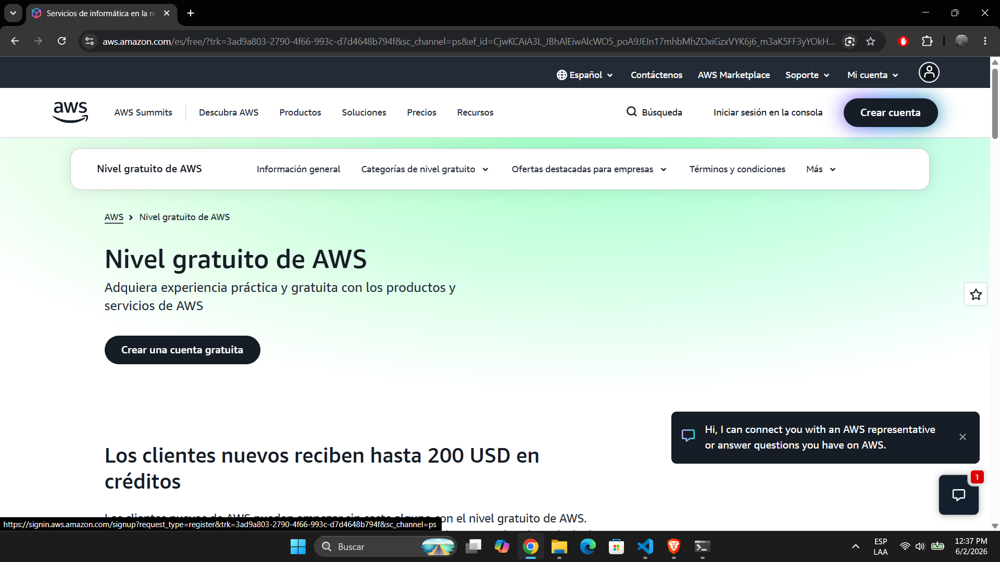
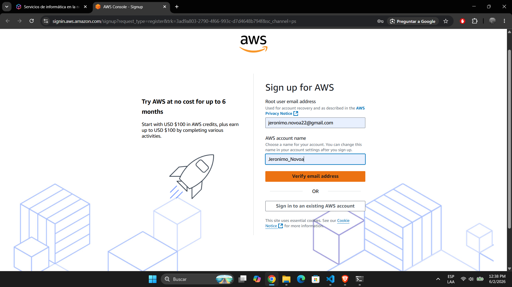
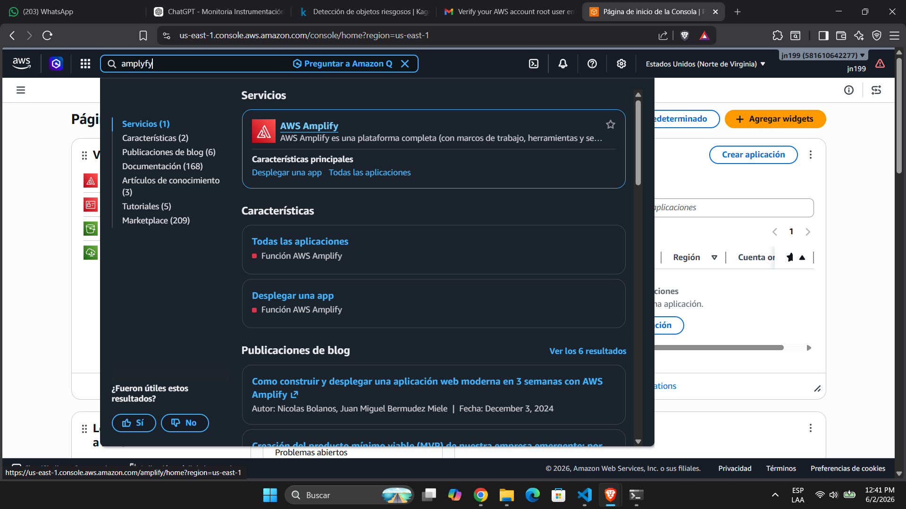
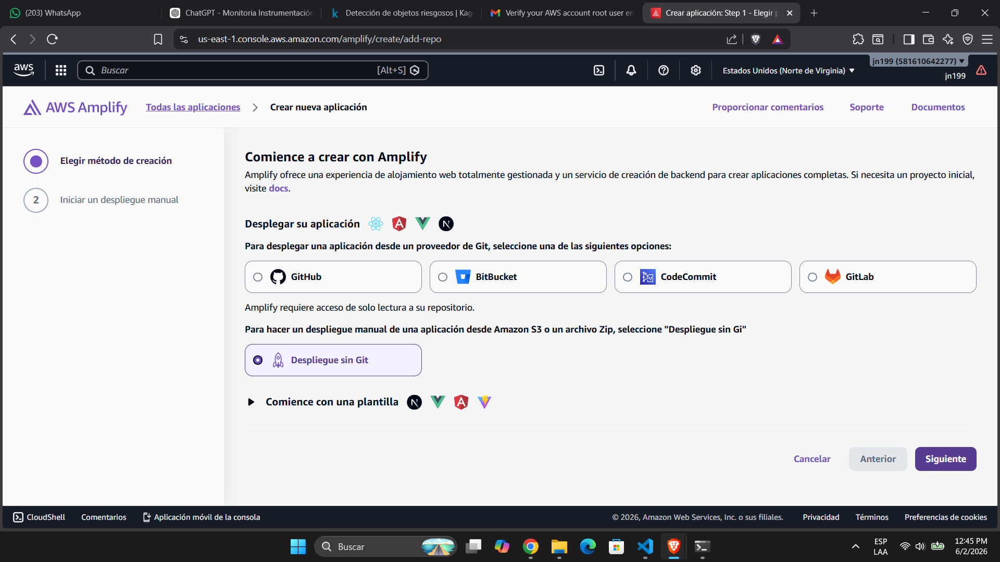
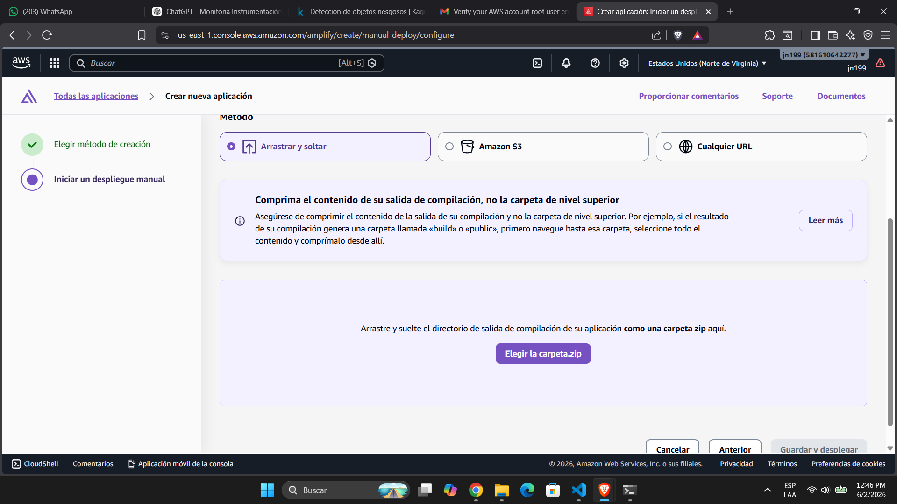
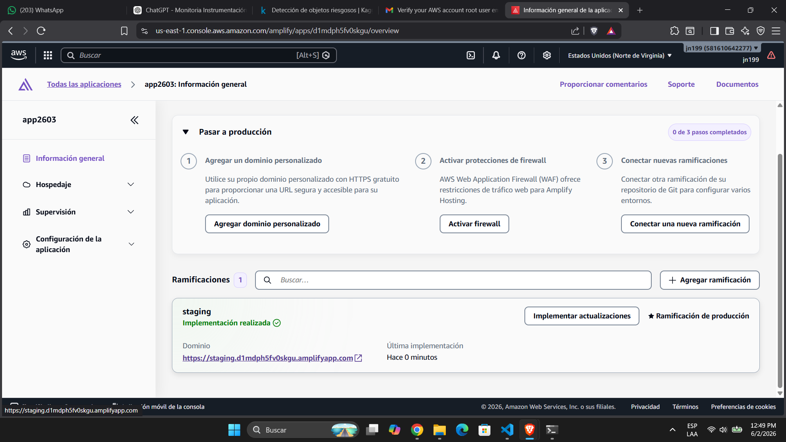

# Instructivo AWS Amplify: despliegue de página web para recepción de datos de ESP32

## 1. Objetivo

El objetivo de este instructivo es desplegar en **AWS Amplify** una página web sencilla que funcionará como interfaz para visualizar e interactuar con los datos enviados desde una **ESP32**.

En este caso se usarán dos archivos base:

- `index.html`: página web que se desplegará en AWS Amplify.
- `Button_1.ino`: código que se carga directamente en la ESP32.

La página web se conecta mediante MQTT al tópico `esp32/boton`, muestra un contador y permite enviar una acción desde la web. La ESP32 también se conecta al mismo tópico MQTT, incrementa el contador cuando se presiona el botón físico o el botón web, y publica la actualización correspondiente.

---

## 2. Archivos necesarios

Antes de iniciar, se debe contar con los siguientes archivos:

```text
index.html
Button_1.ino
```

El archivo que se desplegará en AWS Amplify será únicamente `index.html`. Sin embargo, antes de subirlo a Amplify, debe estar comprimido en formato `.zip`.

La estructura recomendada del archivo comprimido es:

```text
index.zip
└── index.html
```

> Importante: el archivo `index.html` debe quedar directamente dentro del `.zip`, no dentro de una carpeta adicional.

---

## 3. Crear una cuenta en AWS

1. Ingresar al siguiente enlace de registro de AWS:

   <https://signin.aws.amazon.com/signup?request_type=register&trk=3ad9a803-2790-4f66-993c-d7d4648b794f&sc_channel=ps>

2. En la página de registro, crear la cuenta usando un correo electrónico válido.

   

3. Asignar un nombre de usuario para la cuenta.

   

4. Continuar con los pasos de verificación solicitados por AWS.

5. Ingresar la información de tarjeta solicitada por la plataforma.

6. Finalizar el proceso de creación de cuenta siguiendo las instrucciones que aparecen en pantalla.

7. Una vez creada la cuenta, iniciar sesión nuevamente en la consola de AWS.

---

## 4. Ingresar a AWS Amplify

1. Una vez dentro de la consola de AWS, buscar el servicio **AWS Amplify**.

   

2. Ingresar al servicio AWS Amplify.

3. Seleccionar la opción para crear una nueva aplicación.

---

## 5. Crear una nueva aplicación sin Git

1. Al crear la aplicación, seleccionar la opción de despliegue sin repositorio Git.

   

2. Esta opción permite subir directamente el archivo comprimido de la página web sin necesidad de usar GitHub, GitLab u otro repositorio.

---

## 6. Preparar el archivo `index.html`

1. Ubicar el archivo `index.html` en el computador.

2. Comprimir el archivo en formato `.zip`.

   El archivo final puede llamarse, por ejemplo:

   ```text
   index.zip
   ```

3. Verificar que dentro del `.zip` se encuentre directamente el archivo `index.html`.

4. No es necesario comprimir ni subir el archivo `Button_1.ino` a AWS Amplify, ya que ese archivo se carga directamente en la ESP32 desde el entorno de programación usado para el embebido.

---

## 7. Subir la página web a AWS Amplify

1. En AWS Amplify, seleccionar la opción de **arrastrar y soltar**.

2. Subir el archivo `.zip` que contiene la página web.

   

3. Confirmar que el archivo cargado corresponde al `.zip` generado a partir de `index.html`.

4. Dar clic en **Guardar y desplegar**.

5. Esperar a que AWS Amplify finalice el proceso de despliegue.

---

## 8. Acceder a la página desplegada

1. Cuando el despliegue finalice, AWS Amplify mostrará un enlace público de acceso a la página.

2. Abrir el enlace generado por Amplify.

   

3. Verificar que la página cargue correctamente.

4. En la página se debe observar:

   - El título **ESP32 Botón IoT**.
   - Un contador inicial.
   - Un botón llamado **Presionar desde la web**.
   - Un estado de conexión MQTT.

---

## 9. Relación con el código de la ESP32

El archivo `Button_1.ino` se carga directamente en la ESP32. Este código permite que el embebido se conecte a una red WiFi y al broker MQTT usado por la página web.

La comunicación se realiza mediante el tópico:

```text
esp32/boton
```

La página web y la ESP32 deben usar el mismo tópico para que puedan intercambiar información correctamente.

Cuando se presiona el botón físico conectado a la ESP32, el contador aumenta y se publica el nuevo valor. Cuando se presiona el botón desde la página web, la ESP32 recibe el mensaje, incrementa el contador y envía nuevamente la actualización.

---

## 10. Verificación final

Para comprobar que todo funciona correctamente:

1. Cargar el código `Button_1.ino` en la ESP32.

2. Verificar que la ESP32 se conecte correctamente a WiFi.

3. Verificar que la ESP32 se conecte al broker MQTT.

4. Abrir la página desplegada desde el enlace generado por AWS Amplify.

5. Confirmar que el estado de la página indique conexión.

6. Presionar el botón físico de la ESP32 y observar si el contador cambia en la página.

7. Presionar el botón de la página web y verificar si la ESP32 responde correctamente.

---

## 11. Recomendaciones

- Revisar que el archivo `index.html` esté comprimido correctamente antes de subirlo.
- Verificar que la ESP32 tenga configurados correctamente el nombre y la contraseña de la red WiFi.
- Confirmar que tanto la página web como la ESP32 usen el mismo tópico MQTT.
- Si la página no se conecta, revisar la conexión a internet y el estado del broker MQTT.
- Al terminar la práctica, revisar en la consola de AWS si se desea eliminar la aplicación desplegada.

---

## 12. Resultado esperado

Al finalizar el proceso, se tendrá una página web desplegada en AWS Amplify capaz de comunicarse mediante MQTT con una ESP32. Esta página permitirá visualizar el contador y enviar una acción desde la web hacia el embebido.
